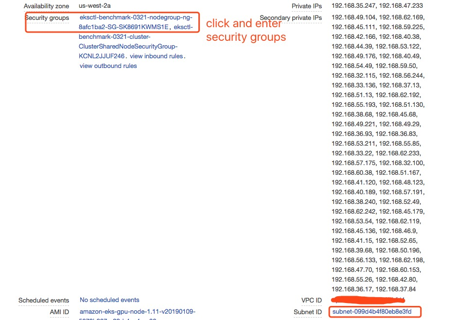
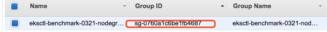

## Static Provisioning Example
This example shows how to make a pre-created FSx for Lustre filesystem mounted inside container. 

### Edit [Persistent Volume Spec](pv.yaml)
```
apiVersion: v1
kind: PersistentVolume
metadata:
  name: fsx-pv
spec:
  capacity:
    storage: 60Gi
  volumeMode: Filesystem
  accessModes:
    - ReadWriteOnce
  persistentVolumeReclaimPolicy: Recycle
  storageClassName: fsx-sc
  csi:
    driver: fsx.csi.aws.com
    volumeHandle: [FileSystemId]
    volumeAttributes:
      dnsname: [DNSName] 
```
Replace `volumeHandle` with `FileSystemId` and `dnsname` with `DNSName`. You can get both `FileSystemId` and `DNSName` using AWS CLI:

```sh
>> aws fsx describe-file-systems
```

### Deploy the Application
Create PV, persistence volume claim (PVC), storageclass and the pod that consumes the PV:
```sh
>> kubectl apply -f examples/kubernetes/static_provisioning/storageclass.yaml
>> kubectl apply -f examples/kubernetes/static_provisioning/pv.yaml
>> kubectl apply -f examples/kubernetes/static_provisioning/claim.yaml
>> kubectl apply -f examples/kubernetes/static_provisioning/pod.yaml
```

## Dynamic Provisioning Example

Once driver starts up, we can prepare Persistent Volume Claim and Storage Class. In order to use FSx for Lustre, we need to create following two files - fsx-sc.yaml and fsx-pvc.yaml

Follow this *guidance* and replace *subnetId*, *securityGroupIds* and *s3ImportPath*. 

* *s3ImportPath* is the bucket you created with dataset in the previous steps.
* You can also easily get *subnetId* and *securityGroupId* by checking AWS EC2 Panel. Note that *ReadWriteMany* is used to let the volume to be shared by Pods.
* Make use your security groups open *port* *988* which is used by Lustre.

1. Open your EC2 Management Console, created the instance by eksctl, and you will find out *subnetId*.  


2. Get your *securityGroupIds* by clicking security group name.  


3. Edit inbound rules and make sure port 988 is open there.  


4. Apply changes to kubernetes

```
kubectl apply -f fsx-sc.yaml
kubectl apply -f fsx-claim.yaml
```

5. Make sure Persistent Volume Claims event doesn't report failures. FSx fro Lutre provision normally takes 5 mins.

```
➜ kubectl describe pvc fsx-claim
Name:          fsx-claim
Namespace:     default
StorageClass:  fsx-sc
Status:        Bound
Volume:        pvc-401131c0-4c3d-11e9-bf71-0eee213c2888
Labels:        <none>
Annotations:   kubectl.kubernetes.io/last-applied-configuration:
                 {"apiVersion":"v1","kind":"PersistentVolumeClaim","metadata":{"annotations":{},"name":"fsx-claim","namespace":"default"},"spec":{"accessMo...
               pv.kubernetes.io/bind-completed: yes
               pv.kubernetes.io/bound-by-controller: yes
               volume.beta.kubernetes.io/storage-provisioner: fsx.csi.aws.com
Finalizers:    [kubernetes.io/pvc-protection]
Capacity:      3600Gi
Access Modes:  RWX
Events:
  Type       Reason                 Age                 From                                                                       Message
  ----       ------                 ----                ----                                                                       -------
  Normal     Provisioning           31m                 fsx.csi.aws.com_fsx-csi-controller-0_ec329017-4c3b-11e9-8e86-52abea5d6e64  External provisioner is provisioning volume for claim "default/fsx-claim"
  Normal     ExternalProvisioning   25m (x26 over 31m)  persistentvolume-controller                                                waiting for a volume to be created, either by external provisioner "fsx.csi.aws.com" or manually created by system administrator
  Normal     ProvisioningSucceeded  24m                 fsx.csi.aws.com_fsx-csi-controller-0_ec329017-4c3b-11e9-8e86-52abea5d6e64  Successfully provisioned volume pvc-401131c0-4c3d-11e9-bf71-0eee213c2888

```
